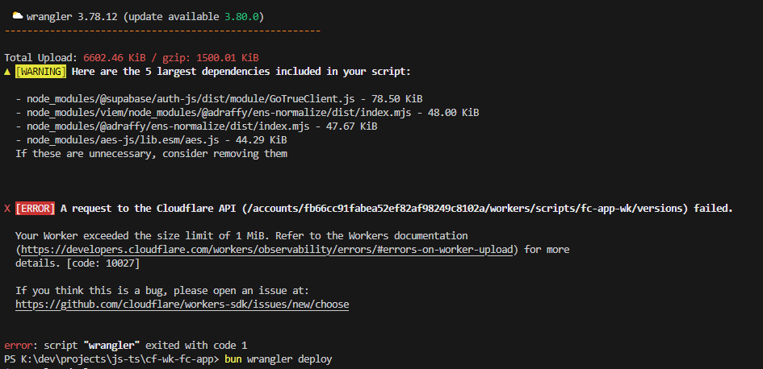

## airstack-frame-verify-web-light

### Description

This package exports a single function that can be used to verify a faracster frame with airstack.

Is super lightweight, works in the browser and nodejs, has 0 dependencies and has been made to be as small as possible so it can be used in constrained environments like web workers, serverless functions, edge functions, etc.

### Why is this useful?

Some envoirments have a very limited amount of codespace also they boot up the code everytime, airstack SDK will import 5MB of code everytime you use it, this package only has a few kb of code and can be used to verify a frame with airstack without using airstack SDK.

<!-- ScreenShot of ISSUE from asstes/cf-airstack.png -->
[](./assets/cf-airstack.png)

### Basic Usage

```bash
# install the package use any package manager you prefer
bun add airstack-frame-verify-web-light@latest
```

```typescript
import { verifyFrameWithAistack } from 'airstack-frame-verify-web-light';
import { AIRSTACK_KEY } from './secret';

// ...request-context

// expects frame to be in the body of the request
const body = await request.json();

const verified = await verifyFrameWithAistack(body, AIRSTACK_KEY);

const { isValid } = verified;

// ...request-context

```

### Notes

Since this package has only one purpose, updates will only happen if there is a change in the airstack API.
